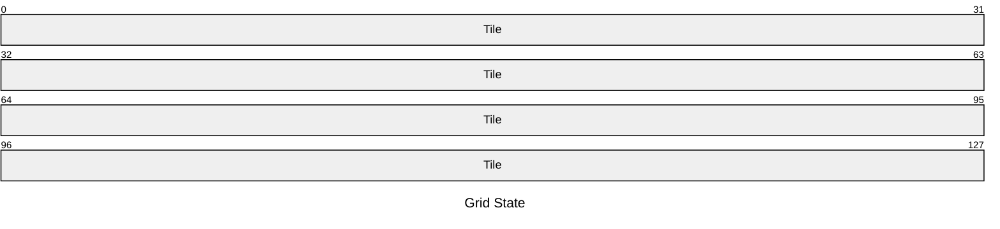
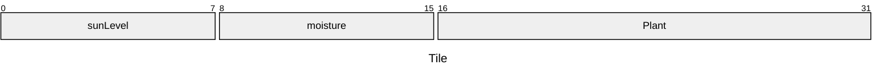

# DevLog Entry 4 - [12/7/2024]

## How we satisfied the software requirements

### F0+F1+F2
No Major Changes were made.

### Internationalization
To support internationalization, we modified our code to distinguish between strings internal to the program and strings that will be shown to the player. We created a `config.json` file that contains translations for all the text in our game. This file includes translations for at least three languages: English, Chinese (Simplified), and Arabic.

We added a method to load the config file in the `preload` method of our `Play` scene and stored the translations in a variable. We also added a method to set the current language and update the displayed text accordingly. This method updates the text content of the buttons and other UI elements based on the selected language.

When adding support for a new language or adding a new translatable message to the game, the following files need to be changed:
- `config.json`: Add the new language and its translations.
- `Play.ts`: Ensure that the new translatable message is updated in the `updateText` method.

### Localization
Our game supports three languages: English, Chinese (Simplified), and Arabic. 

- **English**: The default language of the game. All team members are fluent in English, so no additional help was needed for this localization.
- **Chinese (Simplified)**: We used a combination of our own knowledge and online translation tools to translate the game text into Chinese. We also had a friend who is a native Chinese speaker review the translations to ensure accuracy.
- **Arabic**: We used online translation tools to translate the game text into Arabic. We also had a volunteer classmate who is a native Arabic speaker review the translations to ensure accuracy.

To select the language, the user can click on the language buttons provided in the game. These buttons are labeled with the language names (e.g., "English", "中文", "العربية"). When a language button is clicked, the `setLanguage` method is called, which updates the text content of the buttons and other UI elements based on the selected language. The text direction is also adjusted for right-to-left languages like Arabic.

### Mobile Installation
Since our game is played on the browser, we gave it capabilities to be an installable Progressive Web App in order for it to be able to be installed onto a mobile device. We followed the example given by our professor in order to make this happen, where he created a .webmanifest file and put a link to it in the head of index.html. No changes to the game's code were needed to make it installable.

### Mobile Play (Offline)
This requirement became fulfilled with the completion of the Mobile Installation requirement.

## Reflection
No part of our plan changed this time, but a large part of how our game is did. In this development phase, our game went from needing a keyboard in order to be played to simply needing a way to press a button. We're glad we were finally able to change how the input for our game works, because previously, it felt extremely like a prototype just meant for developers to play. We believe this change makes our game feel at least just a bit more finalized than it used to.

# DevLog Entry 3 - [12/6/2024]

## How we satisfied the software requirements

### F0+F1
No major changes were made. Code was converted from JavaScript to TypeScript however.

### External DSL for Scenario Design
The external DSL is based in JSON, in order to create a new situation, go to the config.json file and edit the sections based on what you want changed. Here is an example json:
```
"grid": {
"height": 4,
"width": 4
},
"win_conditions": {
"maxLevelPlants": 4,
"mushroom": 1,
"grass": 2
}, "events": [
{
    "id": "heavy_rain",
    "turn": 3,
    "effects": {
    "sunLevel": 2,
    "moisture": 8
    }
},
{
    "id": "sunny",
    "turn": 7,
    "effects": {
    "sunLevel": 6
    }
}
],
"human_instructions": "Grow atleast 4 max level plants with 1 mushroom and 2 grass"
```
In this example, the grid is going to be a 4x4, where the player must have 4 max level plants with 1 of them being a mushroom and 2 of them being grass. The only win condition needed to be provided is the maxLevelPlants, the species requirement is optional. For the creating of events, simply enter an id/name for the event, enter a turn number and then list the effects of the event. In the example, the first event is "heavy rain" which actives on turn 3 and applies a sun level of 2 but moisture level of 8 to each tile. The events can currently only change the sunLevel and moisture of every tile, if you want to initialize the game with certain amounts of sun or moisture simply create an event on turn 0 and list the effects. The human instructions lets you write out the win conditions and have it displayed in the instructions area.
### Internal DSL for Plants and Growth Conditions
To create a new plant, simply navigate to plant.ts, locate the static SPECIES attribute, and write in a new plant as a TypeScript object. Grass and mushroom are already defined and make as good examples.
```
GRASS: {
    name: "grass",
    id: 1,
    growthConditions: {
        sunLevel: 3,
        moisture: 5,
        badNeighborName: "mushroom",
        badNeighborDirection: this.DIRECTIONS.LEFT
    }
}
```
What this is saying is that I've defined a plant called GRASS. Its in-game name is "grass", its id is 1, and in order to grow, the tile it's on needs to have a sun level of at least 3, a moisture of at least 5, and the plant to the left of this grass must not be a mushroom.

### Switch to Alternate Platform
Carried Over Code and Data:

Game Logic: Existing JavaScript code, including classes like Player, Grid, Tile, and Plant, was mostly compatible and carried over with type annotations added.
Assets and Configurations: Game assets such as images configuration files remained unchanged.

Redesigned Concepts:

Type Definitions: Interfaces and explicit types were introduced throughout the codebase to define the structure of game entities and data.
Modules and Imports: Code was restructured to use ES6 modules, with proper import and export statements aligning with TypeScript standards.

Originally, the plan was to use JavaScript due to integration difficulties with TypeScript and Phaser. However, with updated documentation and better support, the project shifted to TypeScript. This change provided better tooling and helped catch errors at compile time, enhancing development efficiency.

## Reflection
With F2, the amount of stuff within the repository increased a lot. This is because we needed to bring in a lot more tools, such as Deno, in order to get our game working in TypeScript. So overall, we are now using more tools than before and the project size has increased. I would say working on this project feels a bit more complicated now.

# DevLog Entry 2 - [11/30/2024]

## How we satisfied the software requirements
- [F0.a] Same as last week, but there's a player class now which is in a module
- [F0.b] Same as last week, but interfacing with tiles and plants is different now since those are now both classes which are in modules
- [F0.c] Same as last week
- [F0.d] Same as last week
- [F0.e] Same as last week
- [F0.f] Same as last week, but the sun level and moisture needed for a plant to grow is now stored in a data object for that plant instead of being hard coded
- [F0.g] Same as last week but now there's less tiles so the win condition has been adjusted accordingly
- [F1.a] The grid class stores its state in an attribute called "state." It's a single contiguous byte array that stores tile and plant data in array of structs (AoS) format. Tiles and Plants are simply Phaser sprites that also contain a DataView that views their corresponding portion of the grid's state.





- [F1.b] There are buttons to save to slot 1 and slot 2, and to load from slot 1 and slot 2. Saving involves converting the grid's state (a byte array) to a useable format for localStorage.
- [F1.c] The game autosaves every time after the player plants, reaps, or advances time. When the player comes back to the game in a new session, they can load their autosave by pressing a button. They should not plant, reap, or advance time before loading their autosave in this new session however, or else their autosave will be overridden.
- [F1.d] The player is able to undo planting, reaping, and advancing time. The game remembers its previous and undone game states in order to do this. This memory is also stored in save slots, allowing the player to load a slot and then start undoing or redoing. They can undo all the way to the beginning of the game, and then redo all the way to where they used to be.

## Reflection
Our plan has sort of changed with F1. We didn't make any changes regarding the tools and materials used like we did with F0, but continuing to use JavaScript has created a huge coupling between the program and the developer, where anybody who works on this game needs to be deeply familiar with the variables that exist in it. This is because every variable in JavaScript is an "any." Regarding the game's feedback that it provides to the player, I, and I'm pretty sure the rest of my team, would have liked to add in-game feedback for advancing time, saving/loading, and undoing/redoing, but were unable to due to time constraints. We're not happy that the player basically needs to have the console open while playing with how the game currently is. We hope to be able to add more feedback in the future now that the  game's code has become more modularized.

# DevLog Entry 1 - [11/22/2024]

## How we satisfied the software requirements
### [F0.a] 
In the game, the player's movement is controlled using the WASD keys. The movement functionality is implemented within the handlePlayerMovement() function. The player character moves at a constant velocity defined by the PLAYER_VELOCITY variable (set to 50). The game utilizes a grid system where each tile is TILE_SIZE pixels wide. The grid dimensions are dynamically calculated based on the canvas dimensions using CANVAS_WIDTH, CANVAS_HEIGHT, and TILE_SIZE. The player's position is synced with a hitbox that follows their movement, implemented in the makePlayerTileHitboxFollowPlayer() function.

### [F0.b] 
Time progresses manually in the game through a press of the right arrow key. The functionality is handled by an event listener tied to Phaser.Input.Keyboard.KeyCodes.RIGHT. Each turn progression triggers three processes: advancing the day counter, checking plant growth conditions, and verifying the win condition. These processes are encapsulated in dedicated functions such as setSunAndMoisture(), attemptToGrowPlant(), and checkWin().

### [F0.c] 
The player can reap or sow plants only when standing on a grid tile, determined by the getTilePlayerIsStandingOn() function. Sowing is triggered using the numeric keys (1 for grass and 2 for mushrooms), which invokes the plant() function. Reaping is implemented by pressing Backspace, which removes the plant on the current tile using the reap() function. These mechanics ensure interactivity is limited to the grid tile the player is standing on.

### [F0.d] 
Each tile in the grid has both sunLevel and moisture properties. These levels are updated each time time is advanced through random number generation and are normalized to a range between 0 and 5. The sunLevel resets to zero each day, reflecting the immediate use or loss of sunlight. In contrast, moisture accumulates over time, ensuring persistence as time progresses.

### [F0.e] 
The game includes two plant types: grass and mushroom. Each plant can be level 1 or 2. The level is tied to distinct sprites for visual feedback, updated in attemptToGrowPlant() based on growth conditions.

### [F0.f] 
Plants start at level 1 upon being planted and require specific sun and moisture thresholds to grow: grass needs sun and moisture levels of at least 3 and 5 to grow, and mushrooms need at least 1 and 15. Plants also cannot grow if they have certain neighbors: grass can't grow if there's a mushroom to its left, and mushrooms cant grow if there's grass above them.

### [F0.g] 
The player "beats" the game when they have 10 or more plants that are level 2 or higher. This win condition is monitored in the checkWin() function, which evaluates the winningPlants set to determine if it contains the required entries.

## Reflection
We made a major change during the process of developing our game. Our original language that we wanted to use was Typescript. The implementation and integration of Typescript with Phaser ended up being a lot more complicated and the documentation that we originally found had be outdated for years. Porting the game to Typescript is a complicated task that we need more time with so we believe Typscript shouldn't be the language with start with. We have made some progress on porting the game, so it isn't hopeless and can be done. We will continue to look into how to port our game into Typescript, but will keep developing in Javascript for now.

# Devlog Entry 0 - [11/15/2024]

## Introducing the team
Tools Lead: Derek Simpson
Will research alternative tools, identify good ones, and help every other team member set them up on their own machine in the best 
configuration for this project. Might also establish the team’s coding style guidelines and help peers setup auto-formatting systems. 
Will provide support for systems like source control and automated deployment (if appropriate to the team’s approach).

Engine Lead: William Klunder
Will research alternative engines, get buy-in from teammates on the choice, and teach peers how to use it if it is new to them. 
This might involve making small code examples outside of the main game project to teach others. Will also establish standards for which kinds of code 
should be organized into which folders of the project and try to propose software designs that insulate the rest of the team from many details of the 
underlying engine.

Design Lead: Justin Lam
Responsible for setting the creative direction of the project, and establishing the look and feel of the game. Will make small art or 
code samples for others to help them contribute and maintain game content. Where the project might involve a domain-specific language, 
this person (who is still an engineer in this class) will lead the discussion as to what primitive elements the language needs to provide.
## Tools and materials

We will be using Phaser as our engine and the browser to deploy our game on the WEB. Phaser uses WebGL to deploy a game on the web. We intend to use phaser
because it is an easy and efficient engine that can help us develop our game. Phaser is also a known engine that doesn't require a lot of learning to use which makes
the researching technologies process much easier. Phaser also works well with github pages, so we are able to deploy and iterate our game well using github,

We will be using Javascript and JSON (for saving data and Tiled). Phaser can use Javascript to compile a web based game. Phaser also can take in a JSON file that
contains Tilemap information that references attached images. Javascript is also a well documented language with a lot of libraries that we can use to help us use
abstract ideas for our game. 

We will be using GitHub for version control. Visual Studio Code will be our choice of IDE because we can use its LiveServer extension to test and practice CI/CD. 
Tiled will be used to create tilemaps and levels that the player can interact with. We will also use GitHub pages to publish our game online. We chose
these tools because the entire team is skilled in using these tools to develop an interactive game. 

Typescript will be our alternate platform choice. Phaser can use Typescript to implement and compile video games using yarn and Nodejs. It also shouldn't be too hard of a switch 
since they are sister languages. We will still be using HTML to deploy it on the web, so our deployment system won't be comprimised by the language change. 


## Outlook

The three of us would like to develop a small but well-made game. Since we all have many other commitments, we will strive to write good, 
maintainable code during development so we can get more done with less time. We anticipate meeting design specifications to be hardest part of the project, 
and hope that our goal of writing maintainable code will help us overcome this. By approaching this project with the tools and materials selected above, 
we hope to learn how to do the things we've been learning throughout this class but now within a team setting.